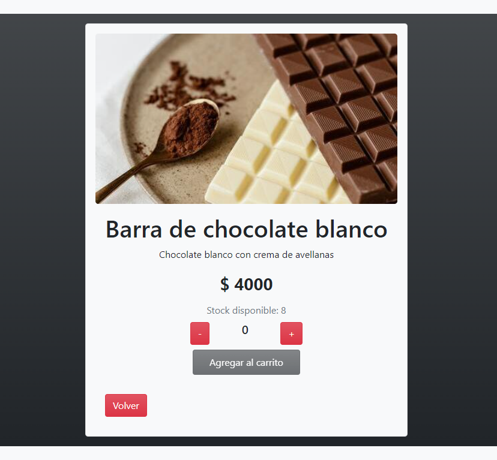
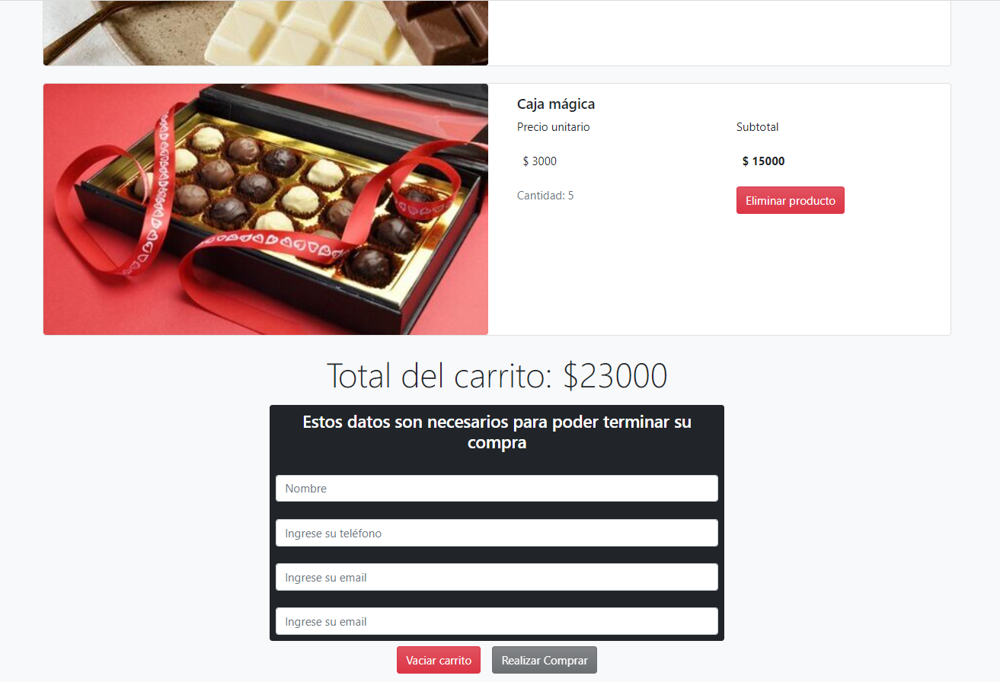

# **Ecommerce - React.js** 
# *Curso de React de Coderhouse*
### **Nahuel-DevOne**
[](mailto:nahue.developer1@gmail.com)
[](https://www.linkedin.com/in/nahuel-developer/)
[](https://github.com/Nahuel-DevOne)

# *Información del proyecto:*

Este es mi proyecto final, para el curso de React.js en [CoderHouse](https://www.coderhouse.com), que forma parte de la carrera de desarrollador web full stack.  
Consiste en un ecommerce implementado con React.js junto React Router, React Hooks, Librería de Bootstrap y Firebase.

## *Version 1.0.0:*

- [](https://determined-goldberg-229a88.netlify.app/)

- Se usa como base de datos Firestore
## *Desarrollado con:*

- [Visual Studio Code](https://code.visualstudio.com/)
- [React](https://reactjs.org/)
- [Create react app](https://create-react-app.dev/)
- [Babel](https://babeljs.io/)
- [Webpack](https://webpack.js.org/)
- [SCSS](http://sass-lang.com/)
- [Bootstrap](https://getbootstrap.com/)
- [react-icons](https://react-icons.github.io/react-icons)

# *Sobre el flujo de compra:*

- [](public/gif-flujo-compra.gif)
<!-- ##  -->

**Screenshots:**

### 1. Home:
## 

### 2. Detalle del producto seleccionado:

## 

### 3. Carrito de compras, con productos seleccionados:

## 

### 4. Carrito de compras, con productos y formulario completo:

## 
### 5. Fin de la compra y mensaje al usuario:

## 

### 6. Si no hay productos en el carrito:

## 
# *Flujo de Compra - Descripción*
  
Para poder comprar uno o más productos, se debe seleccionar desde el Home, en la galería de productos, "COMPRAR" A partir de ahí, ya en la vista de detalle del producto, se debe seleccionar su cantidad para añadirlo al carrito. Para que se habilite el botón de agregar al carrito, debe haber al menos un producto seleccionado. No se permite restar unidades inferiores a cero ni tampoco superar el stock disponible.
Para agregar más productos al carrito, se puede volver al home para seguir sumando productos, que a la vez, de seleccionar el mismo, no se duplica en el carrito, sino que se agrega a la cantidad anteriormente seleccionada.
Una vez seleccionados los productos a comprar, el botón "Terminar compra" lleva al carrito con el o los productos seleccionados. De querer eliminar alguno, cada uno tiene su propio botón de eliminar. De querer eliminarlos todos, se encuentra el botón "Vaciar carrito", dejando el carrito vacío con el mensaje de aviso de que no hay productos en el carrito, y un botón para volver al home. No se permite la compra sin productos seleccionados. 
En el caso de haber agregado productos al carrito, con el fin de terminar la compra, se encuentra el botón de "Realizar compra", que se encuentra deshabilitado por defecto, hasta completar el formulario obligatario, a llenar por el cliente. Dichos datos se guardan en firestore, y una vez realizado este proceso, se vacía el carrito y se le devuelve al usuario un mensaje de agradecimiento, junto con su Id de compra y de que esta se ha realizado correctamente.
# *Componentes:*

## 1. *Main*
## 2. *Header*
## 3. *LogoIcono*
## 4. *Footer*
## 5. *Item*
## 6. *ItemCount* 
## 7. *ItemList* 
## 8. *ItemListContainer*
## 9. *ItemDetail*
## 10. *ItemDetailContainer*
## 11. *Cart*
## 12. *CartItem*
## 13. *CartWidget*
## 14. *CartContext*
## 15. *FormBuyer*
#

# Importante: para descargar y usar el proyecto

### Seguir los siguientes pasos:

- 1. Clonar _'ecommerce'_ repository from GitHub. Abrir la terminal y tipear:

  ```bash
  git clone https://github.com/Nahuel-DevOne/ecommerce
  ```
- 2. cd dentro del directorio de la carpeta y tipear:

  ```bash
  npm install
  ```
  Esto instala las dependencias necesarias.

- 3. Para correr el proyecto:

  ```bash
  npm start
  ```